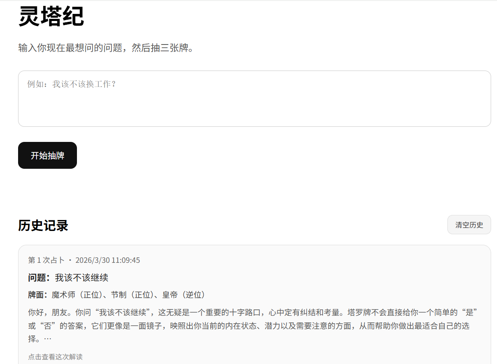

# 🔮 AI Tarot App（灵塔纪）

一个基于 Gemini 大模型的塔罗解读 Web 应用，通过随机抽牌 + AI 推理，为用户提供结构化、理性化的决策参考。

👉 输入问题 → 抽取三张塔罗牌 → 获取 AI 解读

---

## 🔄 系统流程
用户输入问题
   ↓
前端页面（page.tsx）
   ├─ 校验输入内容
   ├─ 检查本地使用次数 / 冷却时间
   ├─ 调用 drawCards() 随机抽取三张牌
   └─ 将「问题 + 牌阵结果」发送到后端接口
   ↓
后端接口（api/tarot_reading/route.ts）
   ├─ 校验请求参数
   ├─ 检查 IP 限流 / 请求频率
   ├─ 组装 Prompt
   └─ 调用 Gemini 模型生成解读
   ↓
AI 模型（Gemini）
   └─ 返回结构化塔罗解读结果
   ↓
后端接口返回 JSON
   ↓
前端页面接收结果
   ├─ 展示三张牌阵
   ├─ 展示 AI 解读内容
   ├─ 更新本地使用状态
   └─ 保存历史记录到 localStorage
   ↓
用户查看结果 / 恢复历史记录

---

## 📸 项目截图



---

## ✨ 核心功能

### 🎴 塔罗抽牌系统
- 内置 22 张塔罗牌数据
- 随机抽取 3 张牌
- 自动生成「正位 / 逆位」
- 每张牌包含：
  - 含义
  - 关键词
  - 爱情 / 事业 / 自我建议

---

### 🧠 AI 解读（Gemini）

基于用户问题 + 抽牌结果，动态生成解读：

- 整体趋势分析
- 每张牌逐一解析
- 可执行建议

特点：
- 避免玄学表达
- 强调理性与现实指导
- 控制输出长度（300~500 字）

---

### 📚 历史记录系统

- 使用 localStorage 持久化
- 自动保存最近 10 条记录
- 支持：
  - 点击恢复历史占卜
  - 清空记录

---

### ⚡ 免费版限制机制

前后端双层控制：

#### 前端限制
- 每日最多 3 次
- 操作冷却时间：8 秒
- 超限提示

#### 后端限流
- 同一 IP 最小间隔：10 秒
- 每小时最多请求：10 次
- 超限返回 429

---

## 🏗️ 技术栈

- **Framework**: Next.js 15（App Router）
- **Language**: TypeScript
- **Frontend**: React Hooks + 原生样式
- **State**: localStorage（历史记录 + 使用次数）
- **AI Model**: Google Gemini（gemini-2.5-flash）
- **API**: Next.js Route Handler
- **部署**: Vercel

---

## 📁 项目结构

```text
src/
├── app/
│   ├── page.tsx                # 主页面：状态管理 + 抽牌 + 调用 API + 渲染组件
│   ├── layout.tsx              # 全局布局：HTML 结构与全局样式
│   └── api/
│       └── tarot_reading/
│           └── route.ts        # 后端接口：调用 Gemini + 限流控制
│
├── components/
│   ├── CardSpread.tsx          # 三张牌阵展示
│   ├── HeroSection.tsx         # 顶部介绍 + 使用状态
│   ├── HistoryPanel.tsx        # 历史记录列表
│   ├── QuestionPanel.tsx       # 问题输入区 + 抽牌按钮
│   ├── ReadingReport.tsx       # AI 解读结果展示
│   └── TipsPanel.tsx           # 使用提示
│
├── data/
│   └── tarot.json              # 塔罗牌数据（22 张牌 + 含义 + 建议）
│
├── lib/
│   ├── tarot.ts                # 抽牌逻辑（随机 + 正逆位）
│   └── usage.ts                # 使用限制（每日次数 + 冷却时间）
│
└── types/
    └── tarot.ts                # 类型定义（TarotCard / DrawnCard / HistoryRecord）
```
---

## ⚙️ 本地运行

### 1. 克隆项目

git clone https://github.com/Rachel-qing/ai-tarot-app.git
cd ai-tarot-app

### 2. 安装依赖

npm install

### 3. 配置环境变量

创建 .env.local：

GEMINI_API_KEY=your_api_key_here
PUBLIC_DEMO_ENABLED=true

### 4. 启动项目
npm run dev